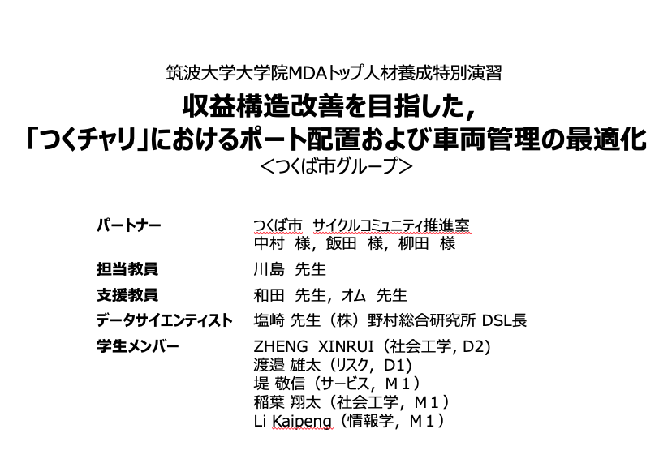
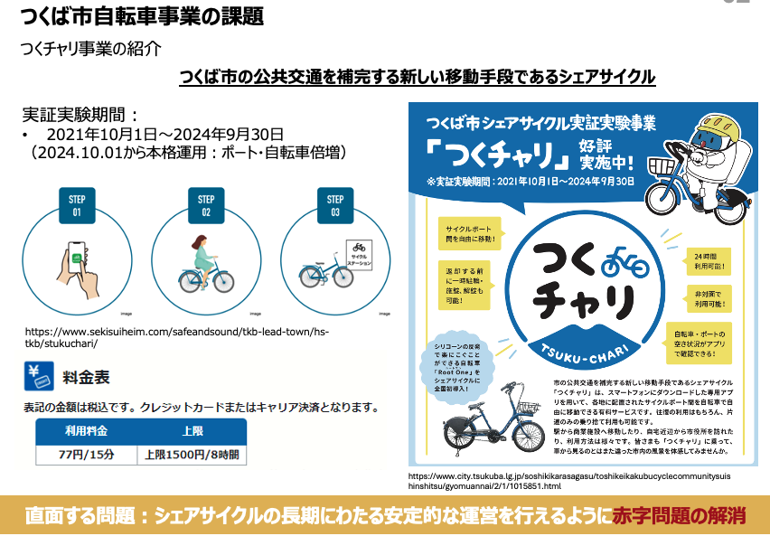
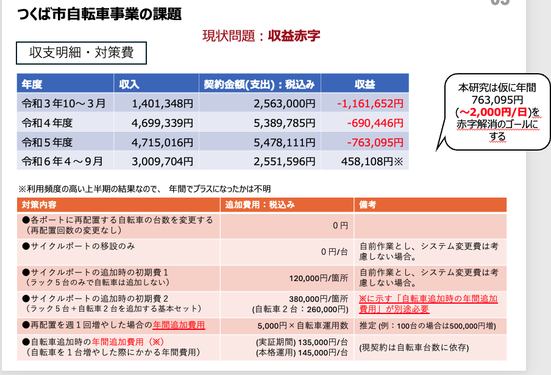
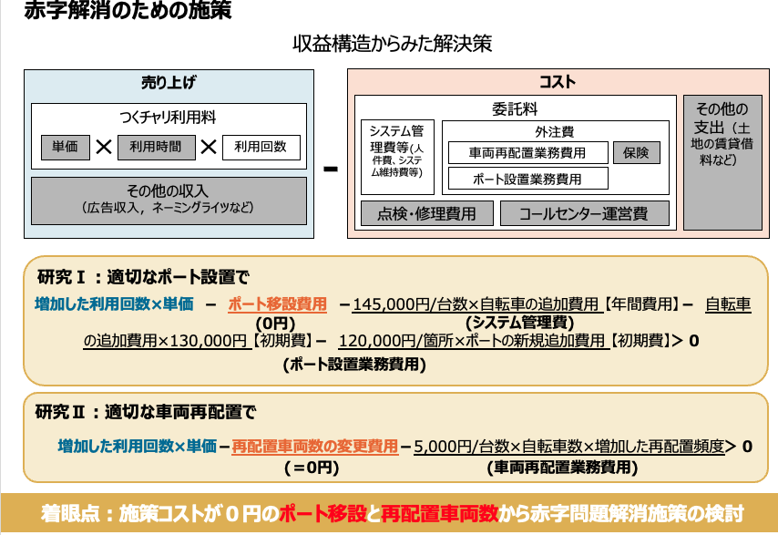

# Share-Cycle Station Placement Prediction Project

# Overview of the Problem and Key Points

The presentation focuses on optimizing the port placement and vehicle management for the **Tsuku-Chari** shared bicycle system in **Tsukuba City**, aiming to improve revenue structure and eliminate deficits.

## Identified Problem

- The **Tsuku-Chari** shared bicycle project is currently operating under a deficit.
- The financial reports from fiscal years **2021 to 2024** indicate consistent losses, with an annual deficit of approximately **763,095 yen (~2,000 yen/day)**.
- The **goal** of the study is to eliminate this deficit through **cost-efficient operational improvements**.

## Current Financial Situation
- The main expenses come from **contract fees**, including system management and bicycle redistribution.
- Despite increasing revenues, **the project remains in deficit**, mainly due to:
  - High costs of **bicycle reallocation**.
  - **Port relocation and installation expenses**.
  - Costs associated with **adding new bicycles**.
- The project plans a **full-scale operation starting from October 2024**, with **an expansion of ports and bicycles**, requiring sustainable financial strategies.

## Proposed Solutions
### 1. Optimal Port Placement  
- Instead of adding new ports, the strategy suggests **relocating existing ports** at **zero cost** whenever possible.
- Minimize installation costs by using **low-cost or existing infrastructure**.

### 2. Efficient Bicycle Redistribution  
- Reduce operational expenses by **minimizing unnecessary bicycle movements**.
- Optimize the **frequency of redistribution** to lower costs while maintaining usability.

### **Key Focus:**
- **Zero-cost measures**, such as **port relocations and optimized bicycle reallocation**, are prioritized to **reduce operational expenses** and eliminate financial losses.
- The study aims to find a **balance between service availability and cost efficiency**.

## Key Contributions

### 1. Research I: User Demand Prediction Model

#### Model Improvement: Enhancing Explanatory Variables

1. **Port Density**: We incorporated variables related to port density within specific buffers (e.g., the number of ports within certain distances). This variable, added by ZHENG, plays a crucial role in understanding the concentration of share-cycle stations and user access points.

2. **Weather Data**: Weather data was integrated into the model, an improvement led by Inaba-san, to account for external factors affecting bicycle usage patterns.

3. **Excess-Zero Problem**: Watanabe-san addressed the issue of excess zeros in the data, optimizing the model to handle cases where the demand for bicycles was zero at certain locations or times.

4. **Human Flow Data**: Additional variables, such as human flow within a 500-meter mesh, were included by ZHENG to enrich the explanatory power of the model.

5. **Reanalysis with XGBoost**: Li reanalyzed the dataset using XGBoost, improving the prediction accuracy by better capturing nonlinear relationships between the explanatory variables.

6. **Transformer Model Construction**: Li also worked on building a Transformer-based model as one of the candidate models to further improve the predictive power.

#### Data Processing and Application

- **Port Data Organization**: We organized variables related to port locations, such as land use type, distance to the nearest train station or bus stop, population data, and human flow data. This process ensures a more structured approach to predicting where share-cycle stations should be placed.

### 2. Research II: Vehicle Redistribution Problem

#### Data Collection and Analysis

1. **Bicycle Data**: Data on the number of available bicycles (collected from 2023.08 to 2024.10) was obtained from Tanaka-san, forming the basis for analyzing current usage patterns and vehicle distribution.

2. **Bicycle Usage Data**: Inaba-san worked on organizing the data related to bicycle usage frequency, a key factor in understanding station demand and usage trends.

3. **Vehicle Data Processing**: ZHENG contributed by analyzing the availability of bicycles at different times, focusing on empty-port scenarios and understanding the factors behind them.

4. **Potential Demand Analysis**: Li prepared to analyze latent demand, with daily potential demand data being processed. ZHENG visualized the current empty port situations, making it easier to interpret usage trends.

#### Output and Scenarios

1. **Demand vs. Supply Analysis**: We identified the gaps between daily potential demand and the number of available bicycles, aiming to highlight mismatches between the number of vehicles and the actual demand.

2. **Scenario Proposals**:
    - **Scenario 1**: Adjust the number of redistributed bicycles based on the demand.
    - **Scenario 2**: Propose the relocation of certain share-cycle stations.
    - **Scenario 3**: Adjust the frequency of vehicle redistribution operations.
    - **Scenario 4**: Add more share-cycle ports, bicycles, and racks to meet increasing demand.

## AI Technology Application and Data Scraping

The integration of AI technologies like **XGBoost**, **Catboost** and **Transformer-based models** plays a central role in addressing complex urban mobility challenges. Through advanced data analysis, these models can predict user demand patterns, optimize vehicle redistribution strategies, and ensure that share-cycle stations are strategically positioned throughout Tsukuba. This data-driven approach not only enhances the efficiency of the share-cycle system but also significantly improves user accessibility and satisfaction.

To support this initiative, automated data scraping is used to collect real-time information from relevant sources such as share-cycle usage data, traffic conditions, and user behaviors. By employing a custom `test.py` file, we can automate the data collection process from official websites and APIs, ensuring that the most up-to-date information is always available for AI model training and evaluation. This method allows for continuous monitoring and adjustment of AI predictions based on real-time trends, leading to more responsive and adaptive urban infrastructure planning.

This project exemplifies the application of AI in real-world settings, where data-driven solutions directly contribute to enhancing public transportation systems and creating smarter, more efficient urban environments. The success of these technologies in Tsukuba's share-cycle program highlights the potential for similar approaches to revolutionize mobility in other cities.

Add the second research
