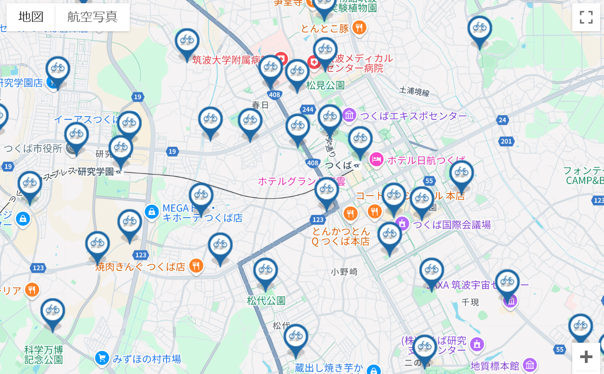

# Share-Cycle Station Placement Prediction

This project, part of the MDA program at the University of Tsukuba in collaboration with the Tsukuba City Government, aims to predict user demand and determine optimal locations for setting up share-cycle stations in Tsukuba.

To achieve this, we employed various models to forecast where to best place the share-cycle stations to meet user needs.
